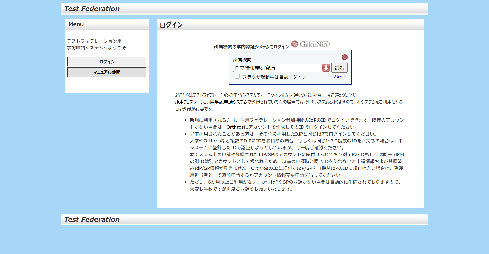
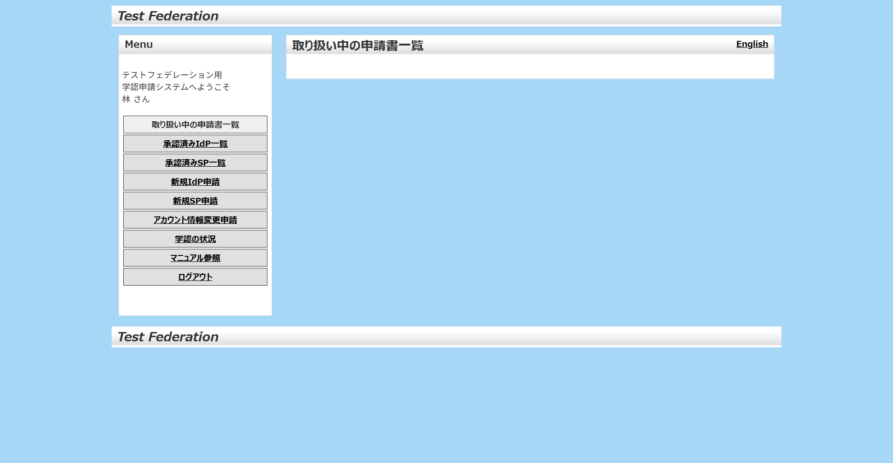
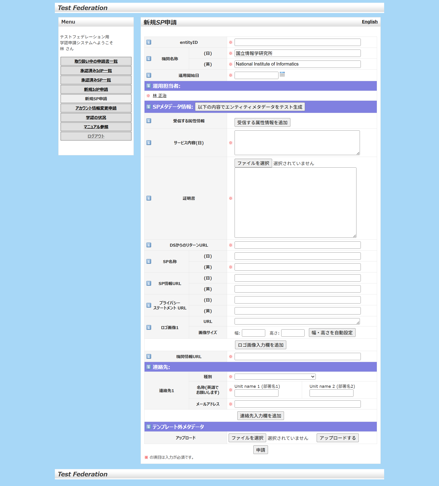
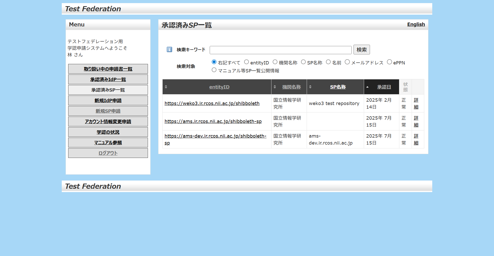
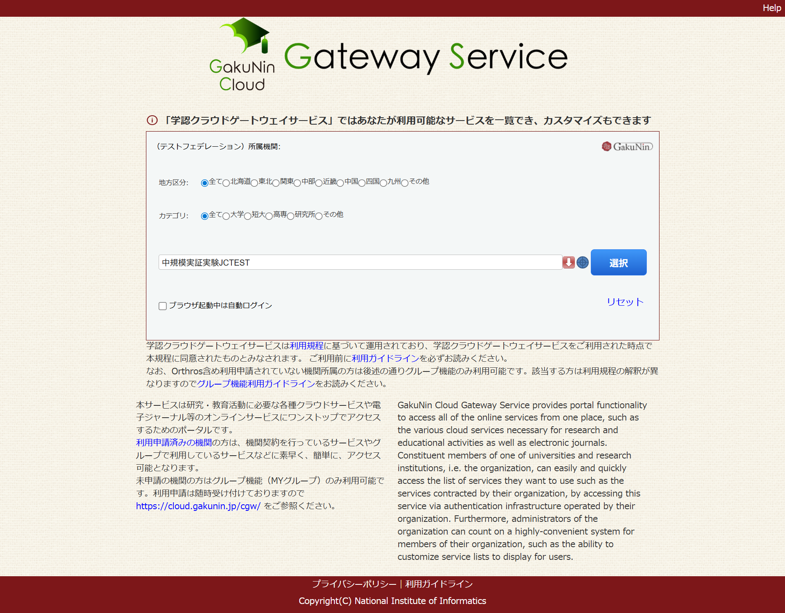
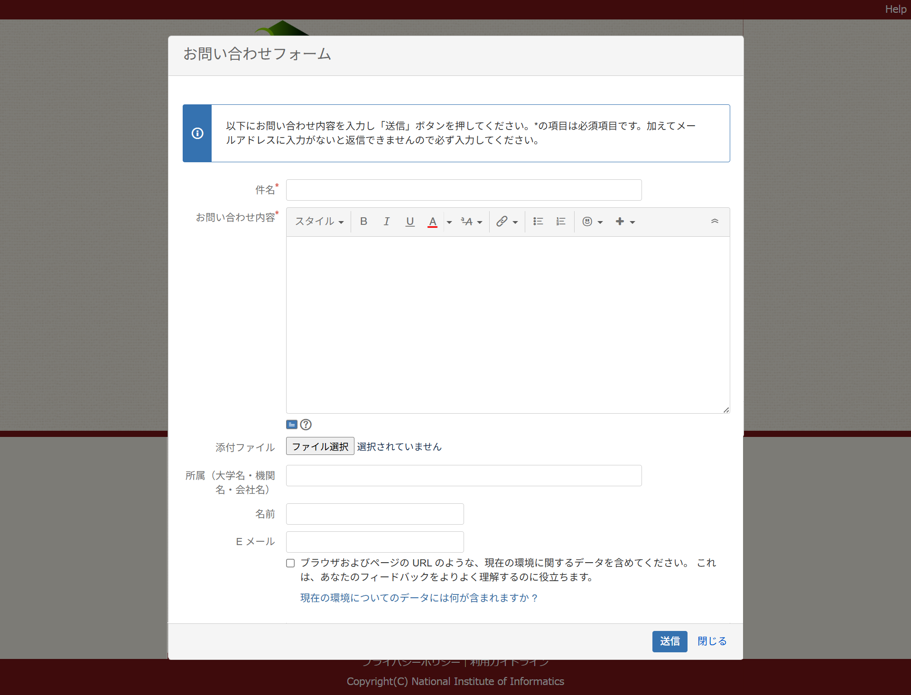
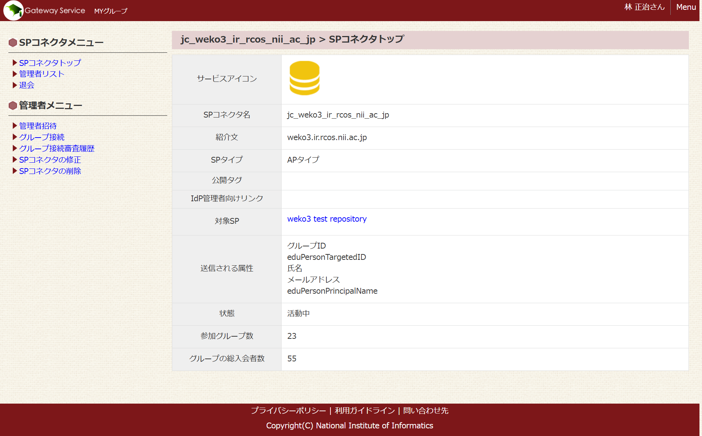

# 学認（テストフェデレーション）対応手順

## 概要

本手順書ではWEKO3における学認テストフェデレーション設定およびOrthrosログイン設定手順を説明する。​

1. 学認SP設定
2. mAP設定
3. Orthros設定

## nginx設定

/etc/nginx/conf.d/weko.conf 

location ~ /secure/　を以下のように書き換える。

```
location ~ /secure/ {
    #include shib_clear_headers;
    more_clear_input_headers 'Shib-Session-ID' 'Shib-Session-Index' 'Remote-User' 'eppn' 'mail' 'isMemberOf' 'DisplayName';
    shib_request /shibauthorizer;
    shib_request_use_headers on;
    include fastcgi_params;
    #include shib_fastcgi_params;

    shib_request_set $shib_shib_session_id $upstream_http_variable_shib_session_id;
    fastcgi_param Shib-Session-ID $shib_shib_session_id;

    shib_request_set $shib_shib_session_index $upstream_http_variable_shib_session_index;
    fastcgi_param Shib-Session-Index $shib_shib_session_index;

    shib_request_set $shib_remote_user $upstream_http_variable_remote_user;
    fastcgi_param Remote-User $shib_remote_user;

    #shib_request_set $shib_mail $upstream_http_variable_mail;
    #fastcgi_param mail $shib_mail;

    shib_request_set $shib_mail $upstream_http_variable_eppn;
    fastcgi_param mail $shib_mail;

    shib_request_set $shib_isMemberOf $upstream_http_variable_isMemberOf;
    fastcgi_param isMemberOf $shib_isMemberOf;

    shib_request_set $shib_displayname $upstream_http_variable_displayname;
    fastcgi_param DisplayName $shib_displayname;

    #shib_request_set $shib_persistent_id $upstream_http_variable_persistent_id;
    #fastcgi_param eppn $shib_persistent_id;

    shib_request_set $shib_eppn $upstream_http_variable_eppn;
    fastcgi_param eppn $shib_eppn;

    fastcgi_split_path_info ^(.+\.py)(.*)$;

    fastcgi_pass unix:/usr/lib/systemd/system/fcgiwrap.socket;
    fastcgi_param SCRIPT_FILENAME $document_root$fastcgi_script_name;

    root /usr/share/nginx/html;
    fastcgi_param NO_CHECK_WEKOSOCIETYAFFILIATION TRUE;
}
```

とくに

$shib_eppn, $shib_mail, $shib_isMemberOf 

の設定箇所を確認する。

$shib_mail は学認IdPからの属性をeppnのみにするため、
$upstream_http_variable_eppn を格納している。

nginxを再起動する。

```
supervisorctl restart nginx
```

## 学認SP設定

### Shibboleth-SPのための証明書の準備

#### 自己署名証明書の作成

学認では、Shibbolethサーバの署名用証明書、暗号化用証明書として自己署名証明書を利用する運用は許されている。証明書の有効期間の問題もあるため、ここでは自己署名証明書を作成する。

```
cd /fs-shibboleth/${FQDN}/
openssl req -x509 -sha256 -nodes -days 3650 -newkey rsa:4096 -subj /CN=${FQDN} -keyout shib.key -out shib.crt
```

作成した証明書をshibboleth2.xmlで読み込めるように設定する。

```
※「</ApplicationDefaults>」の直前に行を挿入してください。
    <CredentialResolver type="Chaining">
      <CredentialResolver type="File" use="signing" 
            key="shib.key" certificate="shib.crt"/>
      <CredentialResolver type="File" use="encryption" 
            key="shib.key" certificate="shib.crt"/>
    </CredentialResolver>
~snip~
```

shibdを再起動し、問題なく動作することを確認する。

```
$ kubectl exec -n weko3 -it ${POD} -c nginx -- bash
groups: cannot find name for group ID 1000
root@${POD}:/tmp# supervisorctl restart shibd
shibd: stopped
shibd: started
```

エラーが発生した場合は``` /var/log/shibboleth/```にあるログを確認する。

※ログの出力先がPOD内となっていることは課題

#### 自己署名証明書の公開​

学認で自己署名証明書を利用する場合は、申請時に公開されている必要がある。

自己署名証明書の置き場所を作成する。

```
cd /fs-nginx/${FQDN}/
mkdir cert
```

自己署名証明書をコピーする。

```
cp /fs-shibboleth/${FQDN}/shib.crt /fs-nginx/${FQDN}/cert/self-signed.crt
```

weko.confに以下を追加し、nginxで自己署名証明書を公開する。

```
    location = /cert/self-signed.crt {
        alias /etc/nginx/cert/self-signed.crt;
    }
```

nginxを再起動し、以下URLから自己署名証明書をダウンロードできることを確認する。

https://${FQDN}/cert/self-signed.crt

#### 学認SP登録申請

https://office.gakunin.nii.ac.jp/TestFed/ にアクセスし、テストフェデレーションへの新規SP申請を行う。

初回アクセス時はアカウント登録が必要となる。



新規SP申請をクリックする。



必要な情報を入力する。



entity ID: https://${FQDN}/shibboleth-sp

shibboleth2.xml の entityID と一致するようにする。

受信する属性情報 に eduPersonPrincipalNameとisMemberOfを追加する。

証明書は公開した自己署名証明書をダウンロードしたものをアップロードする。

DSからのリターンURLは

https://${FQDN}/Shibboleth.sso/DS

とする。

その他必須項目を埋める。


申請ボタンをクリックし、申請が承認されるまで待つ。

#### 学認SP登録の確認​

申請状況は[学認申請システム](https://office.gakunin.nii.ac.jp/TestFed/ )から確認できる。




#### IdPの設定(DS利用する場合は不要)

/etc/shibboleth/shibboleth2.xml ファイルを以下のようにする。
IdPエンティティIDは機関のIdPで置き換える。

```
~snip~
<Sessions lifetime="28800" timeout="3600" relayState="ss:mem" checkAddress="false" handlerSSL="false" cookieProps="http">                                                                                               <SSO entityID="IdPエンティティID" discoveryProtocol="SAMLDS" discoveryURL="test-ds.gakunin.nii.ac.jp/WAYF">
              SAML2
            </SSO>
~snip~
```

#### DSサーバの参照設定(IdP直接ログインの場合は設定不要)

/etc/shibboleth/shibboleth2.xml ファイルを以下のようにする。

```
※「</Sessions>」の直前に行を挿入する。
            <!-- JSON feed of discovery information. -->
            <Handler type="DiscoveryFeed" Location="/DiscoFeed"/>
            <SessionInitiator type="Chaining" Location="/DS" isDefault="true" id="DS">
                <SessionInitiator type="SAML2" template="bindingTemplate.html"/>
                <SessionInitiator type="Shib1"/>
                <SessionInitiator type="SAMLDS" URL="https://test-ds.gakunin.nii.ac.jp/WAYF"/>
            </SessionInitiator>
        </Sessions>
   (省略)
```

#### メタデータの自動更新設定

証明書を格納するディレクトリを作成する。 

```
# mkdir /etc/shibboleth/cert
```

https://www.gakunin.jp/join/test/rule

からフェデレーションメタデータ署名用の証明書をダウンロードして、/etc/shibboleth/cert に格納する。

/etc/shibboleth/shibboleth2.xml ファイルを以下のようにする。

```
    <MetadataProvider type="XML" validate="true" url="https://metadata.gakunin.nii.ac.jp/gakunin-test-metadata.xml" backingFilePath="federation-metadata.xml" maxRefreshDelay="7200">
      <MetadataFilter type="RequireValidUntil" maxValidityInterval="1296000"/>
      <MetadataFilter type="Signature" certificate="/etc/shibboleth/cert/gakunin-test-signer-2020.cer" verifyBackup="false"/>
      <DiscoveryFilter type="Blacklist" matcher="EntityAttributes" trimTags="true" attributeName="http://macedir.org/entity-category" attributeNameFormat="urn:oasis:names:tc:SAML:2.0:attrname-format:uri" attributeValue="http://refeds.org/category/hide-from-discovery"/>
      <TransportOption provider="CURL" option="64">1</TransportOption>
      <TransportOption provider="CURL" option="81">2</TransportOption>
      <TransportOption provider="CURL" option="10065">/etc/ssl/certs/ca-certificates.crt</TransportOption>
    </MetadataProvider>
```

shibdを再起動し、問題なく動作することを確認する。

```
$ kubectl exec -n weko3 -it ${POD} -c nginx -- bash
groups: cannot find name for group ID 1000
root@${POD}:/tmp# supervisorctl restart shibd
shibd: stopped
shibd: started
```

## mAP登録​申請

[SP管理者](https://nii-auth.atlassian.net/wiki/spaces/gakuninmappublic/pages/44532087/SP)を読み、mAP登録を行う。

### mAPアカウントの作成

https://sptest.cg.gakunin.jp/ にアクセスし、ログインする。


初回登録時はアカウント登録が必要となる。

GakuNin Cloud Gateway登録のみでは、SPに関する設定は何もできない。

### SP管理者の登録

画面下の[問い合わせ先](https://cg.gakunin.jp/collectors/cg-inquiry.html)フォームからSP管理者の登録を行う。



問合せフォーム経由で「SP管理者の登録」

件名は以下の様にする。

```
SP管理者登録申請
```

内容は以下の様にする。
```
entityID: https://FQDN/shibboleth-sp
SP管理者：
SP管理者のEPPN
```

SP管理者登録を行いたい旨を、SPのentity IDおよびSP管理者のeppnを一緒に記入し、送信する。
SP管理者はSPの運用担当者である必要がある。

数日すると、SP管理者の登録が完了した連絡がメールでくる。

```
XX様

お世話になっております、学認クラウドゲートウェイサービスサポートです。

TS0931JP https://${FQDN}/shibboleth のSP管理者として、
XX様(ePPN: xxx)を登録いたしました。

SP検証環境の利用にあたり、SPとの連携に関わる情報をお送りいたします。

・SP検証環境のURL
  https://sptest.cg.gakunin.jp/

・連携に関わる設定
  基本的には以下のドキュメントの「SP管理者に必要な情報」と同じですが、
  一部SP検証環境固有の情報があります。

  GakuNinmAPpublic / Home / 学認クラウドゲートウェイサービス連携のための情報
  https://meatwiki.nii.ac.jp/confluence/x/qwBm

  SP検証環境固有の情報を反映した手順を以下にに記載いたしましたの
  でご確認ください。

---
連携に関わる設定 (詳細)
構築したSPとSP検証環境の連携は、以下の手順を参考に設定を行ってください。

・グループメンバー情報を取得できるようにする

  a. 本メールの添付ファイル sptestcgidp-metadata.xml を
     /etc/shibboleth/metadata に保存してください。

  b. shibboleth2.xmlの編集
     /etc/shibboleth/shibboleth2.xml に以下を設定してください。

     ・学認クラウドゲートウェイサービス (SP検証環境) (IdP) メタデータの読み込み
     <MetadataProvider type="XML" 
path="/etc/shibboleth/metadata/sptestcgidp-metadata.xml"/>

     ・SimpleAggregationの追加
     <AttributeResolver type="SimpleAggregation" attributeId="eppn" 
format="urn:oid:1.3.6.1.4.1.5923.1.1.1.6">
         <Entity>https://sptest.cg.gakunin.jp/idp/shibboleth</Entity>
         <saml2:Attribute
xmlns:saml2="urn:oasis:names:tc:SAML:2.0:assertion" 
Name="urn:oid:1.3.6.1.4.1.5923.1.5.1.1" 
NameFormat="urn:oasis:names:tc:SAML:2.0:attrname-format:uri" 
FriendlyName="isMemberOf"/>
     </AttributeResolver>

  c. attribute-map.xmlの編集
     /etc/shibboleth/attribute-map.xmlにisMemberOf属性の設定を行います。
     以下の記述がない場合、最後の</Attributes>の直前に追加してください。

     <Attribute name="urn:oid:1.3.6.1.4.1.5923.1.5.1.1" id="isMemberOf"/>

  d. attribute-policy.xmlの編集
     他のIdPからのisMemberOf属性を拒否し、学認クラウドゲートウェイサー
     ビス (SP検証環境)からのisMemberOfのみを利用する設定を行ないます。

     <!-- Catch-all that pases everything else through unmolested. -->
     の直前に以下の記述を追加してください。

     <AttributeRule attributeID="isMemberOf">
         <PermitValueRule xsi:type="Issuer" 
            value="https://sptest.cg.gakunin.jp/idp/shibboleth"/>
     </AttributeRule>

・SPに対応するSPコネクタを作成する

  SPコネクタ作成の詳細は、学認クラウドゲートウェイサービス利用マニュアルの
  「SPコネクタを作成する」の章をご参照ください。
  https://meatwiki.nii.ac.jp/confluence/pages/viewpage.action?pageId=20873902

補足事項
・New Group APIを利用する場合で、SP側でアクセス制限がされている場合には
  エラーとなります。あらかじめ以下のホストからのアクセスを許可してご利
  用ください。
    ホスト名 : natgw1.sptest.cg.gakunin.jp

以上、よろしくお願いいたします。
--
学認クラウドゲートウェイサービスサポート <cld-gateway-support@nii.ac.jp>
```

メール内容に従ってshibboleth-spの設定を行う。

## Shibboleth-SP：mAP設定

Shibboleth-SPに対してmAP接続のための設定を行う。
基本的には学認クラウドゲートウェイサービスサポートからの指示内容に従う。
Shibbolethの設定ファイルはXMLであるため、
環境によってはNamespaceが異なる場合もあるため、その場合は適宜補う。

### metadataファイルの設置

メタデータファイルを設置するためのディレクトリを作成する。

```
mkdir /etc/shibboleth/metadata
```

学認クラウドゲートウェイサービスサポートから
送られてきたsptestcgidp-metadata.xmlを作成したディレクトリに
コピーする。

/etc/shibboleth/shibboleth2.xml ファイルを以下のようにする。

```
※学認フェデレーションのMetadataProviderの次に設定する。
<MetadataProvider type="XML" 
path="/etc/shibboleth/metadata/sptestcgidp-metadata.xml"/>
```

### SimpleAggregationの追加

/etc/shibboleth/shibboleth2.xml ファイルを以下のようにする。

```
※「AttributeExtractor」の次に挿入する。

    <!-- mAPからisMemberOfを取得するための設定-->
    <AttributeResolver type="SimpleAggregation" attributeId="eppn"
format="urn:oid:1.3.6.1.4.1.5923.1.1.1.6">
      <Entity>https://sptest.cg.gakunin.jp/idp/shibboleth</Entity>
      <saml2:Attribute xmlns:saml2="urn:oasis:names:tc:SAML:2.0:assertion" Name="urn:oid:1.3.6.1.4.1.5923.1.5.1.1" NameFormat="urn:oasis:names:tc:SAML:2.0:attrname-format:uri" FriendlyName="isMemberOf"/>
    </AttributeResolver>
```

### SPコネクタ作成​

下記サイト説明を参考にSPコネクタを作成する。

[SPコネクタの作成](https://nii-auth.atlassian.net/wiki/spaces/gakuninmappublic/pages/44532218)

SPコネクタ名は「jc_」をプレフィックスとして、FQDNの「-」[.]を「_」に置き換えたものとする。

例：

```
https://weko3.ir.rcos.nii.ac.jp

jc_weko3_ir_rcos_nii_ac_jp
```

[SPコネクタ設定イメージ](pics/gakunin_test_image007.png)

### グループの作成​

[https://sptest.cg.gakunin.jp/map/mygroups/view](https://sptest.cg.gakunin.jp/)にアクセスし、
グループを作成する。

グループIDおよびグループ名の命名規則は

SPコネクタ名_ロール識別子となる。
ロール識別子はWEKO3の設定「WEKO_ACCOUNTS_GAKUNIN_GROUP_PATTERN_DICT」で定義されている。

```
WEKO_ACCOUNTS_GAKUNIN_GROUP_PATTERN_DICT = {
    "prefix":"jc",
    "sysadm_group":"jc_roles_sysadm",
    "role_keyword":"roles",
    "role_mapping":{
        "repoadm":"Repository Administrator",
        "comadm":"Community Administrator",
        "contributor":"Contributor",
    }
}
```

例えば、上記の場合、リポジトリ管理者のロール識別子は「repoadm」となる。
システム管理者のグループIDは「sysadm_group」で定義されている「jc_roles_sysadm」が利用される。

#### システム管理者グループの作成（1度限り）

システム管理者グループ「jc_roles_sysadm」はリポジトリ共通のグループである。
グループ作成済みであればこの作業はスキップする。


そうでない場合は、以下設定どおりに入力し、グループを作成する。

|設定名|設定値|
|---|---|
|グループの公開・非公開|非公開|
|メンバー参加条件|管理者からの招待のみ参加できる|
|グループメンバーの公開・非公開|グループ入会者のみに公開|
|グループ名 必須|jc_roles_sysadm|
|グループID 必須|jc_roles_sysadm|
|紹介文 必須|JAIRO Cloudのシステム管理者|

「作成」ボタンをクリックする。

グループ「jc_roles_sysadm」が作成される。


#### リポジトリ用グループの作成

[https://sptest.cg.gakunin.jp/map/mygroups/view](https://sptest.cg.gakunin.jp/)にアクセスし、
下記条件のグループを作成する。

##### リポジトリ管理者

|設定名|設定値|
|---|---|
|グループの公開・非公開|非公開|
|メンバー参加条件|管理者からの招待のみ参加できる|
|グループメンバーの公開・非公開|グループ入会者のみに公開|
|グループ名 必須|SPコネクタ名_roles_repoadm|
|グループID 必須|SPコネクタ名_roles_repoadm|
|紹介文 必須|JAIRO Cloudのシステム管理者|

「作成」ボタンをクリックする。

グループ「SPコネクタ名_roles_repoadm」が作成される。


##### コントリビュータ

|設定名|設定値|
|---|---|
|グループの公開・非公開|非公開|
|メンバー参加条件|管理者からの招待のみ参加できる|
|グループメンバーの公開・非公開|グループ入会者のみに公開|
|グループ名 必須|SPコネクタ名_roles_contributor|
|グループID 必須|SPコネクタ名_roles_contributor|
|紹介文 必須|JAIRO Cloudのシステム管理者|

「作成」ボタンをクリックする。

グループ「SPコネクタ名_roles_contributor」が作成される。


### SPコネクタへのグループ追加

SPコネクタ管理者画面にアクセスする。



グループ接続->新たなグループを接続を選択する。

先ほど作成したグループ「SPコネクタ名_roles_repoadm」「SPコネクタ名_roles_contributor」およびjc_roles_sysadmをSPコネクタに接続する。

グループメンバにシステム管理者を管理者として追加する。
（※トラブル対応目的）
グループメンバに機関のリポジトリ管理者1名を管理者として追加する。

## 機関側​の設定

リポジトリ側のSP設定完了後、機関にSPのentityIDとともに設定完了を伝える。

## リポジトリ設定​


|設定|説明|デフォルト値|
|---|---|---|
|WEKO_ACCOUNTS_WAYF_URL|DSのURLを設定する。|"https://ds.gakunin.nii.ac.jp/WAYF"|
|WEKO_ACCOUNTS_WAYF_ADDITIONAL_IDPS|embeded DSに追加するIdPのリスト。|	[{"name":"Orthros","entityID":"https://orthros.gakunin.nii.ac.jp/idp"}]|
|WEKO_ACCOUNTS_DEFAULT_IDP|デフォルトで選択するIdP|""|
|WEKO_ACCOUNTS_SHIB_LOGIN_ENABLED|Shibbolethログインを有効にするか。|False|
|WEKO_ACCOUNTS_SHIB_IDP_LOGIN_ENABLED|UMSを利用するか|True|
|WEKO_ACCOUNTS_SHIB_DP_LOGIN_DIRECTLY_ENABLED|DSのみとするか|True|
|WEKO_ACCOUNTS_SHIB_INST_LOGIN_DIRECTLY_ENABLED|UMS直接切り替えられるか|True|
|WEKO_ACCOUNTS_SHIB_BIND_GAKUNIN_MAP_GROUPS|学認グループを有効化|False|
|GROUP_INFO_REDIS_DB|グループ情報を格納するRedisのDB番号|4|
|WEKO_ACCOUNTS_IDP_ENTITY_ID|SPのエンティティID||
|WEKO_ACCOUNTS_SSO_ATTRIBUTE_MAP|環境属性値のマッピング|{                                                  'SHIB_ATTR_EPPN': (False, 'shib_eppn'),'SHIB_ATTR_ROLE_AUTHORITY_NAME': (False, 'shib_role_authority_name'),'SHIB_ATTR_SITE_USER_WITHIN_IP_RANGE_FLAG': (False, 'shib_ip_range_flag'),'SHIB_ATTR_MAIL': (False, 'shib_mail'),'SHIB_ATTR_USER_NAME': (False, 'shib_user_name'),"SHIB_ATTR_IS_MEMBER_OF": (False, 'shib_is_member_of'),"SHIB_ATTR_ORGANIZATION": (False, 'shib_organization'),}|     

### DS非利用

学認対応（DS非利用）にするには、instance.cfgは以下の様に設定する。

```
WEKO_ACCOUNTS_SHIB_LOGIN_ENABLED = True
WEKO_ACCOUNTS_SHIB_IDP_LOGIN_ENABLED = True
WEKO_ACCOUNTS_SHIB_DP_LOGIN_DIRECTLY_ENABLED = False
WEKO_ACCOUNTS_SHIB_INST_LOGIN_DIRECTLY_ENABLED = True
WEKO_ACCOUNTS_SHIB_BIND_GAKUNIN_MAP_GROUPS = True
```

```
WEKO_ACCOUNTS_IDP_ENTITY_ID=学認SPのエンティティID
```

```
WEKO_ACCOUNTS_SSO_ATTRIBUTE_MAP = {
    'eppn': (False, 'shib_eppn'),
    'HTTP_WEKOSOCIETYAFFILIATION': (False, 'shib_role_authority_name'),
    'SHIB_ATTR_SITE_USER_WITHIN_IP_RANGE_FLAG': (False, 'shib_ip_range_flag'),
    'mail': (False, 'shib_mail'),
    'HTTP_WEKOID': (False, 'shib_user_name'),
    "isMemberOf": (False, 'shib_is_member_of'),
    "o": (False, 'shib_organization'),
}
```

```
WEKO_ACCOUNTS_GAKUNIN_DEFAULT_GROUP_MAPPING = {
 "学認SPのエンティティID": ["jc_weko3_ir_rcos_nii_ac_jp_roles_contributor"]
}
```

### 本番フェデレーション利用時

本番フェデレーションにする場合は、shobboleth2.xml設定の他、以下instance.cfgの変更も行う。

```
WEKO_ACCOUNTS_GAKUNIN_MAP_BASE_URL = 'https://cg.gakunin.jp'
WEKO_ACCOUNTS_WAYF_URL ="https://ds.gakunin.nii.ac.jp/WAYF" 
WEKO_ACCOUNTS_WAYF_ADDITIONAL_IDPS = [{"name":"Orthros","entityID":"https://orthros.gakunin.nii.ac.jp/idp"}]
```

## Orthros登録

以下サイトを参照しながら登録する。

[SP管理者向けマニュアル](https://github.com/gakunin/orthros-docs/tree/main/docs/SP%E7%AE%A1%E7%90%86%E8%80%85%E5%90%91%E3%81%91%E3%83%9E%E3%83%8B%E3%83%A5%E3%82%A2%E3%83%AB)


具体的には以下サイトのとおりに実施する。

[Orthrosとの接続依頼方法](https://github.com/gakunin/orthros-docs/blob/main/docs/SP%E7%AE%A1%E7%90%86%E8%80%85%E5%90%91%E3%81%91%E3%83%9E%E3%83%8B%E3%83%A5%E3%82%A2%E3%83%AB/2%20Orthros%E3%81%A8%E3%81%AE%E6%8E%A5%E7%B6%9A%E4%BE%9D%E9%A0%BC%E6%96%B9%E6%B3%95%E3%81%AB%E3%81%A4%E3%81%84%E3%81%A6/1%20Orthros%E3%81%A8%E3%81%AE%E6%8E%A5%E7%B6%9A%E4%BE%9D%E9%A0%BC%E6%96%B9%E6%B3%95.md)


申請本文の例

```
■ご担当者様情報
・氏名：XXX
・フリガナ：XXX

・機関名称：XXX
・フリガナ：XXX

・所属学部/部署
XXX
・職名
XXX
・電話番号
XXX
・E-mail
XXX
・住所
XXX

[テスト環境]
・接続SPのentityID※1：
https://${FQDN}/shibboleth-sp
・OrthrosのSP管理者として登録する方のOrthrosアカウントID（メールアドレス）※2：
XXX
・サービス名称：XXX
・サービス名称（英語）：XXX
・サービスURL：https://${FQDN}/
・サービス説明：XXX
```


## Shibboleth-SPの設定値例

#### shibboleth2.xml

```
<?xml version="1.0"?>
<SPConfig xmlns="urn:mace:shibboleth:3.0:native:sp:config" xmlns:conf="urn:mace:shibboleth:3.0:native:sp:config" clockSkew="180">
  <OutOfProcess tranLogFormat="%u|%s|%IDP|%i|%ac|%t|%attr|%n|%b|%E|%S|%SS|%L|%UA|%a"/>
  <UnixListener address="/tmp/shibd.sock"/>
  <RequestMapper type="XML">
    <RequestMap>
      <Host name="${FQDN}" authType="shibboleth" requireSession="true" redirectToSSL="443">
        <Path name="/secure"/>
      </Host>
    </RequestMap>
  </RequestMapper>
  <ApplicationDefaults entityID="https://${FQDN}/shibboleth" REMOTE_USER="eppn persistent-id targeted-id" cipherSuites="DEFAULT:!EXP:!LOW:!aNULL:!eNULL:!DES:!IDEA:!SEED:!RC4:!3DES:!kRSA:!SSLv2:!SSLv3:!TLSv1:!TLSv1.1">
    <Sessions lifetime="28800" timeout="3600" relayState="ss:mem" checkAddress="false" handlerSSL="false" cookieProps="http">
      <SSO entityID="https://idp.repo.nii.ac.jp/idp/shibboleth" discoveryProtocol="SAMLDS" discoveryURL="test-ds.gakunin.nii.ac.jp/WAYF">
              SAML2
            </SSO>
      <Logout>SAML2 Local</Logout>
      <LogoutInitiator type="Admin" Location="/Logout/Admin" acl="127.0.0.1 ::1"/>
      <Handler type="MetadataGenerator" Location="/Metadata" signing="false"/>
      <Handler type="Status" Location="/Status" acl="127.0.0.1 ::1"/>
      <Handler type="Session" Location="/Session" showAttributeValues="false"/>
      <Handler type="DiscoveryFeed" Location="/DiscoFeed"/>
      <SessionInitiator type="Chaining" Location="/DS" isDefault="true" id="DS">
        <SessionInitiator type="SAML2" template="bindingTemplate.html"/>
        <SessionInitiator type="Shib1"/>
        <SessionInitiator type="SAMLDS" URL="https://test-ds.gakunin.nii.ac.jp/WAYF"/>
      </SessionInitiator>
    </Sessions>
    <Errors supportContact="root@localhost" helpLocation="/about.html" styleSheet="/shibboleth/main.css"/>

    <!-- 学認Fed用メタデータの設定 -->
    <MetadataProvider type="XML" validate="true" url="https://metadata.gakunin.nii.ac.jp/gakunin-test-metadata.xml" backingFilePath="federation-metadata.xml" maxRefreshDelay="7200">
      <MetadataFilter type="RequireValidUntil" maxValidityInterval="1296000"/>
      <MetadataFilter type="Signature" certificate="/etc/shibboleth/cert/gakunin-test-signer-2020.cer" verifyBackup="false"/>
      <DiscoveryFilter type="Blacklist" matcher="EntityAttributes" trimTags="true" attributeName="http://macedir.org/entity-category" attributeNameFormat="urn:oasis:names:tc:SAML:2.0:attrname-format:uri" attributeValue="http://refeds.org/category/hide-from-discovery"/>
      <TransportOption provider="CURL" option="64">1</TransportOption>
      <TransportOption provider="CURL" option="81">2</TransportOption>
      <TransportOption provider="CURL" option="10065">/etc/ssl/certs/ca-certificates.crt</TransportOption>
    </MetadataProvider>

    <!-- mAPメタデータの設定-->
    <MetadataProvider type="XML" path="/etc/shibboleth/metadata/sptestcgidp-metadata.xml"/>
    <!-- Orthrosメタデータの設定-->
    <MetadataProvider type="XML" path="/etc/shibboleth/metadata/orthrosstg-idp-metadata.xml"/>
    
    <AttributeExtractor type="XML" validate="true" reloadChanges="false" path="attribute-map.xml"/>

    <!-- mAPからisMemberOfを取得するための設定-->
    <AttributeResolver type="SimpleAggregation" attributeId="eppn"
format="urn:oid:1.3.6.1.4.1.5923.1.1.1.6">
      <Entity>https://sptest.cg.gakunin.jp/idp/shibboleth</Entity>
      <saml2:Attribute xmlns:saml2="urn:oasis:names:tc:SAML:2.0:assertion" Name="urn:oid:1.3.6.1.4.1.5923.1.5.1.1" NameFormat="urn:oasis:names:tc:SAML:2.0:attrname-format:uri" FriendlyName="isMemberOf"/>
    </AttributeResolver>


    <AttributeFilter type="XML" validate="true" path="attribute-policy.xml"/>

    <CredentialResolver type="Chaining">
      <CredentialResolver type="File" key="server.key" certificate="server.crt"/>
      <CredentialResolver type="File" use="encryption" key="weko3.ir.rcos.nii.ac.jp.key" certificate="weko3.ir.rcos.nii.ac.jp.cer"/>
    </CredentialResolver>
  </ApplicationDefaults>
  <SecurityPolicyProvider type="XML" validate="true" path="security-policy.xml"/>
  <ProtocolProvider type="XML" validate="true" reloadChanges="false" path="protocols.xml"/>
</SPConfig>
```

#### attribute-policy.xml

現状の設定は緩いため、もう少し絞ったほうがよいかもしれない。

```
<afp:AttributeFilterPolicyGroup
    xmlns="urn:mace:shibboleth:2.0:afp:mf:basic"
    xmlns:saml="urn:mace:shibboleth:2.0:afp:mf:saml"
    xmlns:basic="urn:mace:shibboleth:2.0:afp:mf:basic"
    xmlns:afp="urn:mace:shibboleth:2.0:afp"
    xmlns:xsi="http://www.w3.org/2001/XMLSchema-instance">


    <afp:AttributeFilterPolicy>
        <afp:PolicyRequirementRule xsi:type="ANY"/>

        <afp:AttributeRule attributeID="*">
            <afp:PermitValueRule xsi:type="ANY"/>
        </afp:AttributeRule>

    </afp:AttributeFilterPolicy>

</afp:AttributeFilterPolicyGroup>
```

#### attribute-map.xml

eppn, isMemberOf が設定されていることを確認する。
（attirbute-map.xmlは必要なものだけに整理してもよいと思う）

```
<Attributes xmlns="urn:mace:shibboleth:2.0:attribute-map" xmlns:xsi="http://www.w3.org/2001/XMLSchema-instance">


    <Attribute name="urn:oasis:names:tc:SAML:attribute:subject-id" id="subject-id">
        <AttributeDecoder xsi:type="ScopedAttributeDecoder" caseSensitive="false"/>
    </Attribute>

    <Attribute name="urn:oasis:names:tc:SAML:attribute:pairwise-id" id="pairwise-id">
        <AttributeDecoder xsi:type="ScopedAttributeDecoder" caseSensitive="false"/>
    </Attribute>


    <Attribute name="urn:oid:1.3.6.1.4.1.5923.1.1.1.6" id="eppn">
        <AttributeDecoder xsi:type="ScopedAttributeDecoder" caseSensitive="false"/>
    </Attribute>
    <Attribute name="urn:mace:dir:attribute-def:eduPersonPrincipalName" id="eppn">
        <AttributeDecoder xsi:type="ScopedAttributeDecoder" caseSensitive="false"/>
    </Attribute>

    <Attribute name="urn:oid:1.3.6.1.4.1.5923.1.1.1.9" id="affiliation">
        <AttributeDecoder xsi:type="ScopedAttributeDecoder" caseSensitive="false"/>
    </Attribute>
    <Attribute name="urn:mace:dir:attribute-def:eduPersonScopedAffiliation" id="affiliation">
        <AttributeDecoder xsi:type="ScopedAttributeDecoder" caseSensitive="false"/>
    </Attribute>

    <Attribute name="urn:oid:1.3.6.1.4.1.5923.1.1.1.7" id="entitlement"/>
    <Attribute name="urn:mace:dir:attribute-def:eduPersonEntitlement" id="entitlement"/>

    <Attribute name="urn:oid:1.3.6.1.4.1.5923.1.1.1.10" id="persistent-id">
        <AttributeDecoder xsi:type="NameIDAttributeDecoder" formatter="$NameQualifier!$SPNameQualifier!$Name" defaultQualifiers="true"/>
    </Attribute>

    <Attribute name="urn:oasis:names:tc:SAML:2.0:nameid-format:persistent" id="persistent-id">
        <AttributeDecoder xsi:type="NameIDAttributeDecoder" formatter="$NameQualifier!$SPNameQualifier!$Name" defaultQualifiers="true"/>
    </Attribute>

    <Attribute name="urn:oid:1.3.6.1.4.1.5923.1.1.1.11" id="assurance"/>


    <Attribute name="urn:oid:1.3.6.1.4.1.5923.1.1.1.13" id="eduPersonUniqueId">
        <AttributeDecoder xsi:type="ScopedAttributeDecoder" caseSensitive="false"/>
    </Attribute>
    <Attribute name="urn:oid:1.3.6.1.4.1.5923.1.1.1.16" id="eduPersonOrcid">
        <AttributeDecoder xsi:type="StringAttributeDecoder" caseSensitive="false"/>
    </Attribute>
    <Attribute name="urn:mace:dir:attribute-def:eduPersonOrcid" id="eduPersonOrcid">
        <AttributeDecoder xsi:type="StringAttributeDecoder" caseSensitive="false"/>
    </Attribute>
    <Attribute name="urn:oid:2.5.4.4" id="sn"/>
    <Attribute name="urn:oid:2.5.4.42" id="givenName"/>
    <Attribute name="urn:oid:2.16.840.1.113730.3.1.241" id="displayName"/>
    <Attribute name="urn:oid:0.9.2342.19200300.100.1.3" id="mail"/>
    <Attribute name="urn:oid:2.5.4.10" id="o"/>
    <Attribute name="urn:oid:2.5.4.11" id="ou"/>


    <!-- eduMember attributes -->
    <Attribute name="urn:oid:1.3.6.1.4.1.5923.1.5.1.1" id="isMemberOf"/>

    <!-- GakuNin attributes -->
    <Attribute name="urn:oid:1.3.6.1.4.1.32264.1.1.1" id="jasn">
        <AttributeDecoder xsi:type="StringAttributeDecoder" caseSensitive="false"/>
    </Attribute>
    <Attribute name="urn:oid:1.3.6.1.4.1.32264.1.1.2" id="jaGivenName">
        <AttributeDecoder xsi:type="StringAttributeDecoder" caseSensitive="false"/>
    </Attribute>
    <Attribute name="urn:oid:1.3.6.1.4.1.32264.1.1.3" id="jaDisplayName">
        <AttributeDecoder xsi:type="StringAttributeDecoder" caseSensitive="false"/>
    </Attribute>
    <Attribute name="urn:oid:1.3.6.1.4.1.32264.1.1.4" id="jao">
        <AttributeDecoder xsi:type="StringAttributeDecoder" caseSensitive="false"/>
    </Attribute>
    <Attribute name="urn:oid:1.3.6.1.4.1.32264.1.1.5" id="jaou">
        <AttributeDecoder xsi:type="StringAttributeDecoder" caseSensitive="false"/>
    </Attribute>
    <Attribute name="urn:oid:1.3.6.1.4.1.32264.1.1.6" id="gakuninScopedPersonalUniqueCode">
        <AttributeDecoder xsi:type="ScopedAttributeDecoder" caseSensitive="false"/>
    </Attribute>

    <Attribute name="urn:mace:dir:attribute-def:mail" id="mail"/>
    <Attribute name="urn:mace:dir:attribute-def:displayName" id="displayName"/>
    <Attribute name="urn:mace:dir:attribute-def:wekoId" id="wekoId"/>
    <Attribute name="urn:mace:dir:attribute-def:wekoGmoIdentifier" id="wekoGmoIdentifier"/>
    <Attribute name="urn:mace:dir:attribute-def:wekoSocietySubGroup" id="wekoSocietySubGroup"/>
    <Attribute name="urn:mace:dir:attribute-def:wekoSocietyAffiliation" id="wekoSocietyAffiliation"/>
    <Attribute name="urn:mace:dir:attribute-def:wekoActiveUser" id="wekoActiveUser"/>

    <Attribute name="urn:oid:0.9.2342.19200300.100.1.3" id="mail"/>
    <Attribute name="urn:oid:2.16.840.1.113730.3.1.241" id="displayName"/>
    <Attribute name="urn:oid:1.3.6.1.4.1.32264.2.1.1" id="wekoId"/>
    <Attribute name="urn:oid:1.3.6.1.4.1.32264.2.1.2" id="wekoGmoIdentifier"/>
    <Attribute name="urn:oid:1.3.6.1.4.1.32264.2.1.6" id="wekoSocietyAffiliation"/>
    <Attribute name="urn:oid:1.3.6.1.4.1.32264.2.1.7" id="wekoSocietySubGroup"/>
    <Attribute name="urn:oid:1.3.6.1.4.1.32264.2.1.8" id="wekoActiveUser"/>

</Attributes>
```


## cache-db-linkageの設定

GakuNin mAPのAPIを用いてグループ情報を取得し、
Redisに保存する。

### 設定

更新があるので割愛

### 実行

更新があるので割愛

### 手動設定方法

ハッシュ値としてグループ情報を設定する。

|キー名| 説明|値例|
|---|---|---|
|updated_at|更新日時|2025-11-14T04:29:12+00:00|
|groups|カンマ区切りのグループ名|jc_roles_sysadm, jc_weko3_ir_rcos_nii_ac_jp_roles_contributor, jc_weko3_ir_rcos_nii_ac_jp_roles_repoadm|

FQDNの「.」および「-」を「_」に置き換えた文字列をキー名とする。

例えば、weko3.ir.rcos.nii.ac.jpの場合は、以下のようにハッシュ値を設定する。

```
HSET weko3_ir_rcos_nii_ac_jp_gakunin_groups updated_at "2025-11-14T04:29:12+00:00" groups "jc_roles_sysadm, jc_weko3_ir_rcos_nii_ac_jp_roles_contributor, jc_weko3_ir_rcos_nii_ac_jp_roles_repoadm"
```

値の確認にはHGETを使う。

```
HGET weko3_ir_rcos_nii_ac_jp_gakunin_groups updated_at
```

```
HGET weko3_ir_rcos_nii_ac_jp_gakunin_groups groups
```

## トラブルシューティング

### デバグログ出力

Shibbolethのメッセージ等をデバグログに出力する場合は、shibd.logger を設定する。

以下の項目を追加する。

```
log4j.category.Shibboleth.SSO=DEBUG
log4j.category.OpenSAML.MessageDecoder=DEBUG
log4j.category.OpenSAML.MessageEncoder=DEBUG
log4j.category.OpenSAML.SecurityPolicyRule=DEBUG
```

変更後、shibdを再起動する。