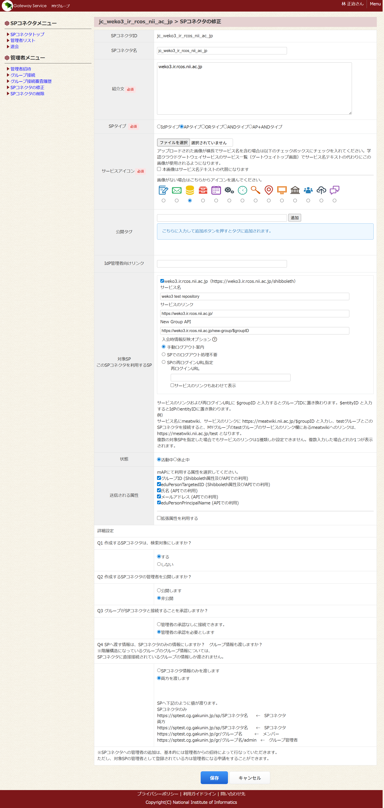
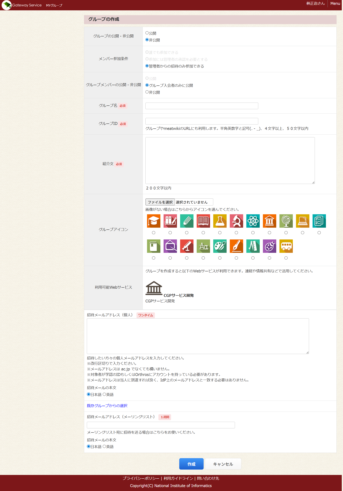
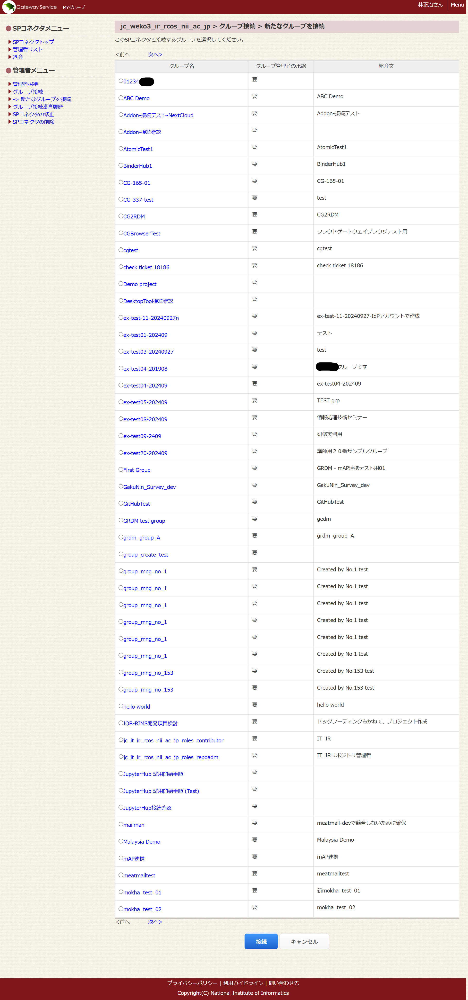

# 学認（テストフェデレーション）対応手順

## 環境構築の概要

本手順書ではWEKO3における学認テストフェデレーション設定およびOrthrosログイン設定手順を説明する。​

1. Shibbboleth-SPの設定
2. nginxの設定
3. 学認SP登録申請
4. Shibboleth-SPの設定2
5. GakuNin mAP登録申請
6. Shibboleth-SPの設定3
7. mAPの設定
8. WEKO3の設定
9. cache-db-linkageの設定
10. 【補足】トラブルシューティング
11. 【補足】Shibboleth-IdPの設定
12. 【補足】本番フェデレーション利用時の変更点
13. 想定運用手順


### Shibboleth-SPの設定

#### 自己署名証明書を作成する

学認では、Shibbolethサーバの署名用証明書、暗号化用証明書として自己署名証明書を利用する運用は許されている。証明書の有効期間の問題もあるため、ここでは自己署名証明書を作成する。

```
cd /etc/nginx/
openssl req -x509 -sha256 -nodes -days 3650 -newkey rsa:4096 -subj /CN=${FQDN} -keyout shib.key -out shib.crt
```

#### 自己署名証明書を設定する

作成した証明書をshibboleth2.xmlで読み込めるように設定する。

「</ApplicationDefaults>」の直前に行を挿入する。

```
~snip~
    <CredentialResolver type="Chaining">
      <CredentialResolver type="File" use="signing" 
            key="shib.key" certificate="shib.crt"/>
      <CredentialResolver type="File" use="encryption" 
            key="shib.key" certificate="shib.crt"/>
    </CredentialResolver>
~snip~
```

shibdを再起動し、ログにエラーがでてないことを確認する。

```
$ kubectl exec -n weko3 -it ${POD} -c nginx -- bash
groups: cannot find name for group ID 1000
root@${POD}:/tmp# supervisorctl restart shibd
shibd: stopped
shibd: started
```

エラーが発生した場合は```/var/log/shibboleth/```にあるログを確認する。

### nginxの設定

WEKO3ではShibboleth対応のために[nginx-http-shibbolethモジュール](github.com/nginx-shib/nginx-http-shibboleth)を利用する。

#### Shibboleth-SPからアプリケーションに渡す属性を設定する

/etc/nginx/conf.d/weko.conf の```location ~ /secure/```を以下のように書き換える。

```
location ~ /secure/ {
    #include shib_clear_headers;
    more_clear_input_headers 'Shib-Session-ID' 'Shib-Session-Index' 'Remote-User' 'eppn' 'mail' 'isMemberOf' 'DisplayName';
    shib_request /shibauthorizer;
    shib_request_use_headers on;
    include fastcgi_params;
    #include shib_fastcgi_params;

    shib_request_set $shib_shib_session_id $upstream_http_variable_shib_session_id;
    fastcgi_param Shib-Session-ID $shib_shib_session_id;

    shib_request_set $shib_shib_session_index $upstream_http_variable_shib_session_index;
    fastcgi_param Shib-Session-Index $shib_shib_session_index;

    shib_request_set $shib_remote_user $upstream_http_variable_remote_user;
    fastcgi_param Remote-User $shib_remote_user;

    #shib_request_set $shib_mail $upstream_http_variable_mail;
    #fastcgi_param mail $shib_mail;

    shib_request_set $shib_mail $upstream_http_variable_eppn;
    fastcgi_param mail $shib_mail;

    shib_request_set $shib_isMemberOf $upstream_http_variable_isMemberOf;
    fastcgi_param isMemberOf $shib_isMemberOf;

    shib_request_set $shib_displayname $upstream_http_variable_displayname;
    fastcgi_param DisplayName $shib_displayname;

    #shib_request_set $shib_persistent_id $upstream_http_variable_persistent_id;
    #fastcgi_param eppn $shib_persistent_id;

    shib_request_set $shib_eppn $upstream_http_variable_eppn;
    fastcgi_param eppn $shib_eppn;

    fastcgi_split_path_info ^(.+\.py)(.*)$;

    fastcgi_pass unix:/usr/lib/systemd/system/fcgiwrap.socket;
    fastcgi_param SCRIPT_FILENAME $document_root$fastcgi_script_name;

    root /usr/share/nginx/html;
    fastcgi_param NO_CHECK_WEKOSOCIETYAFFILIATION TRUE;
}
```

とくに```$shib_eppn```,```$shib_mail```,```$shib_isMemberOf```の設定箇所を確認する。

```$shib_mail```は学認IdPから取得する属性をeppnのみにするために、
```$upstream_http_variable_eppn```を格納している。

nginxを再起動する。

```
supervisorctl restart nginx
```

#### Shibboleth-SPで利用している自己署名証明書を公開できるようにする​（学認申請用）

学認で自己署名証明書を利用する場合は、申請時に公開されている必要がある。

自己署名証明書の置き場所を作成する。

```
mkdir /etc/nginx/cert
```

自己署名証明書をコピーする。

```
cp /etc/nginx/shib.crt /etc/nginx/cert/self-signed.crt
```

weko.confに以下を追加し、nginxで自己署名証明書を公開する。

```
    location = /cert/self-signed.crt {
        alias /etc/nginx/cert/self-signed.crt;
    }
```

nginxを再起動し、以下URLから自己署名証明書をダウンロードできることを確認する。

```
supervisorctl restart nginx
```

```https://${FQDN}/cert/self-signed.crt```から自己署名証明書をダウンロードできることを書くんンする。

### 学認SP登録申請

#### 新規SP申請を行う

https://office.gakunin.nii.ac.jp/TestFed/ にアクセスし、テストフェデレーションへの新規SP申請を行う。

初回アクセス時はアカウント登録が必要となる。


新規SP申請をクリックする。


必要な情報を入力する。


entity ID: https://${FQDN}/shibboleth-sp

shibboleth2.xml の entityID と一致するようにする。

受信する属性情報 に eduPersonPrincipalNameとisMemberOfを追加する。

証明書は公開した自己署名証明書をダウンロードしたものをアップロードする。

DSからのリターンURLは

https://${FQDN}/Shibboleth.sso/DS

とする。

その他必須項目を埋める。


申請ボタンをクリックし、申請が承認されるまで待つ。

#### 学認SPが登録されたことを確認する​

申請状況は[学認申請システム](https://office.gakunin.nii.ac.jp/TestFed/ )から確認できる。


### Shibboleth-SPの設定2

#### 学認フェデレーションのメタデータの自動更新を設定する

証明書を格納するディレクトリを作成する。 

```
mkdir /etc/shibboleth/cert
```

[テストフェデレーションの概要とルール](https://www.gakunin.jp/join/test/rule)からフェデレーションメタデータ署名用の証明書をダウンロードして、```/etc/shibboleth/cert```に格納する。

/etc/shibboleth/shibboleth2.xml ファイルを以下のようにする。

```
    <MetadataProvider type="XML" validate="true" url="https://metadata.gakunin.nii.ac.jp/gakunin-test-metadata.xml" backingFilePath="federation-metadata.xml" maxRefreshDelay="7200">
      <MetadataFilter type="RequireValidUntil" maxValidityInterval="1296000"/>
      <MetadataFilter type="Signature" certificate="/etc/shibboleth/cert/gakunin-test-signer-2020.cer" verifyBackup="false"/>
      <DiscoveryFilter type="Blacklist" matcher="EntityAttributes" trimTags="true" attributeName="http://macedir.org/entity-category" attributeNameFormat="urn:oasis:names:tc:SAML:2.0:attrname-format:uri" attributeValue="http://refeds.org/category/hide-from-discovery"/>
      <TransportOption provider="CURL" option="64">1</TransportOption>
      <TransportOption provider="CURL" option="81">2</TransportOption>
      <TransportOption provider="CURL" option="10065">/etc/ssl/certs/ca-certificates.crt</TransportOption>
    </MetadataProvider>
```

#### Shibboleth-SPにログインで利用する学認IdPを設定する

/etc/shibboleth/shibboleth2.xml ファイルを以下のようにする。
IdPエンティティIDは機関のIdPで置き換える。

```
~snip~
<Sessions lifetime="28800" timeout="3600" relayState="ss:mem" checkAddress="false" handlerSSL="false" cookieProps="http">
<SSO entityID="IdPエンティティID" discoveryProtocol="SAMLDS" discoveryURL="test-ds.gakunin.nii.ac.jp/WAYF">
    SAML2
  </SSO>
~snip~
```

shibdを再起動し、ログにエラーがでてないことを確認する。

```
supervisorctl restart shibd
```

### GakuNin mAP登録​申請

[SP管理者](https://nii-auth.atlassian.net/wiki/spaces/gakuninmappublic/pages/44532087/SP)を読み、mAP登録を行う。

#### mAPアカウントを作成する

https://sptest.cg.gakunin.jp/ にアクセスし、ログインする。


初回登録時はアカウント登録が必要となる。

GakuNin Cloud Gateway登録のみでは、SPに関する設定は何もできない。

#### SP管理者を登録する

画面下の[問い合わせ先](https://cg.gakunin.jp/collectors/cg-inquiry.html)フォームからSP管理者の登録を行う。


問合せフォーム経由で「SP管理者の登録」

件名は以下の様にする。

```
SP管理者登録申請
```

内容は以下の様にする。
```
entityID: https://FQDN/shibboleth-sp
SP管理者：
SP管理者のEPPN
```

SP管理者登録を行いたい旨を、SPのentity IDおよびSP管理者のeppnを一緒に記入し、送信する。
SP管理者はSPの運用担当者である必要がある。

数日すると、SP管理者の登録が完了した連絡がメールでくる。

```
XX様

お世話になっております、学認クラウドゲートウェイサービスサポートです。

TS0931JP https://${FQDN}/shibboleth のSP管理者として、
XX様(ePPN: xxx)を登録いたしました。

SP検証環境の利用にあたり、SPとの連携に関わる情報をお送りいたします。

・SP検証環境のURL
  https://sptest.cg.gakunin.jp/

・連携に関わる設定
  基本的には以下のドキュメントの「SP管理者に必要な情報」と同じですが、
  一部SP検証環境固有の情報があります。

  GakuNinmAPpublic / Home / 学認クラウドゲートウェイサービス連携のための情報
  https://meatwiki.nii.ac.jp/confluence/x/qwBm

  SP検証環境固有の情報を反映した手順を以下にに記載いたしましたの
  でご確認ください。

---
連携に関わる設定 (詳細)
構築したSPとSP検証環境の連携は、以下の手順を参考に設定を行ってください。

・グループメンバー情報を取得できるようにする

  a. 本メールの添付ファイル sptestcgidp-metadata.xml を
     /etc/shibboleth/metadata に保存してください。

  b. shibboleth2.xmlの編集
     /etc/shibboleth/shibboleth2.xml に以下を設定してください。

     ・学認クラウドゲートウェイサービス (SP検証環境) (IdP) メタデータの読み込み
     <MetadataProvider type="XML" 
path="/etc/shibboleth/metadata/sptestcgidp-metadata.xml"/>

     ・SimpleAggregationの追加
     <AttributeResolver type="SimpleAggregation" attributeId="eppn" 
format="urn:oid:1.3.6.1.4.1.5923.1.1.1.6">
         <Entity>https://sptest.cg.gakunin.jp/idp/shibboleth</Entity>
         <saml2:Attribute
xmlns:saml2="urn:oasis:names:tc:SAML:2.0:assertion" 
Name="urn:oid:1.3.6.1.4.1.5923.1.5.1.1" 
NameFormat="urn:oasis:names:tc:SAML:2.0:attrname-format:uri" 
FriendlyName="isMemberOf"/>
     </AttributeResolver>

  c. attribute-map.xmlの編集
     /etc/shibboleth/attribute-map.xmlにisMemberOf属性の設定を行います。
     以下の記述がない場合、最後の</Attributes>の直前に追加してください。

     <Attribute name="urn:oid:1.3.6.1.4.1.5923.1.5.1.1" id="isMemberOf"/>

  d. attribute-policy.xmlの編集
     他のIdPからのisMemberOf属性を拒否し、学認クラウドゲートウェイサー
     ビス (SP検証環境)からのisMemberOfのみを利用する設定を行ないます。

     <!-- Catch-all that pases everything else through unmolested. -->
     の直前に以下の記述を追加してください。

     <AttributeRule attributeID="isMemberOf">
         <PermitValueRule xsi:type="Issuer" 
            value="https://sptest.cg.gakunin.jp/idp/shibboleth"/>
     </AttributeRule>

・SPに対応するSPコネクタを作成する

  SPコネクタ作成の詳細は、学認クラウドゲートウェイサービス利用マニュアルの
  「SPコネクタを作成する」の章をご参照ください。
  https://meatwiki.nii.ac.jp/confluence/pages/viewpage.action?pageId=20873902

補足事項
・New Group APIを利用する場合で、SP側でアクセス制限がされている場合には
  エラーとなります。あらかじめ以下のホストからのアクセスを許可してご利
  用ください。
    ホスト名 : natgw1.sptest.cg.gakunin.jp

以上、よろしくお願いいたします。
--
学認クラウドゲートウェイサービスサポート <cld-gateway-support@nii.ac.jp>
```

メール内容に従ってshibboleth-spの設定を行う。

#### sptest.cg.gakunin.jpへの接続元アドレスの追加を申請する

問合せフォーム経由でSPからsptest.cg.gakunin.jpへの接続元アドレスの追加を申請する。

```
件名：sptest.cg.gakunin.jp 接続元アドレス追加のお願い
```

```
内容：
ご担当者様

お世話になっております。XXXと申します。
下記アドレスについてsptest.cg.gakunin.jp への接続をご許可いただけないでしょうか。

1XXX.XXX.XXX.XXX

以上、宜しくお願い致します。
```


### Shibboleth-SPの設定3

Shibboleth-SPに対してmAP接続のための設定を行う。
基本的には学認クラウドゲートウェイサービスサポートからの指示内容に従う。
Shibbolethの設定ファイルはXMLであるため、
環境によってはNamespaceが異なる場合もあるため、その場合は適宜補う。

#### mAPのメタデータファイルをShibboleth-SPが読めるようにする

メタデータファイルを設置するためのディレクトリを作成する。

```
mkdir /etc/shibboleth/metadata
```

学認クラウドゲートウェイサービスサポートから
送られてきたメタデータファイル```sptestcgidp-metadata.xml```を
作成したディレクトリにコピーする。

```
cp sptestcgidp-metadata.xml /etc/shibboleth/metadata/
```

/etc/shibboleth/shibboleth2.xml に以下のようにする。
追加場所は```gakunin-test-metadata.xml```を
読み込んでいる```MetadataProvider```の次に挿入する。

```
<MetadataProvider type="XML" 
path="/etc/shibboleth/metadata/sptestcgidp-metadata.xml"/>
```

#### SimpleAggregationを追加する

mAPからグループ情報を取得できるようにするためにSimpleAggregationを利用する。

```/etc/shibboleth/shibboleth2.xml```ファイルに以下を追加する。
```AttributeExtractor```の次に挿入する。

```
<!-- mAPからisMemberOfを取得するための設定-->
<AttributeResolver type="SimpleAggregation" attributeId="eppn"
format="urn:oid:1.3.6.1.4.1.5923.1.1.1.6">
    <Entity>https://sptest.cg.gakunin.jp/idp/shibboleth</Entity>
    <saml2:Attribute xmlns:saml2="urn:oasis:names:tc:SAML:2.0:assertion" Name="urn:oid:1.3.6.1.4.1.5923.1.5.1.1" NameFormat="urn:oasis:names:tc:SAML:2.0:attrname-format:uri" FriendlyName="isMemberOf"/>
</AttributeResolver>
```

#### attribute-map.xmlを修正する。

/etc/shibboleth/attribute-map.xmlにisMemberOf属性の設定を行う。
以下の記述がない場合、最後の</Attributes>の直前に追加する。

```
<Attribute name="urn:oid:1.3.6.1.4.1.5923.1.5.1.1" id="isMemberOf"/>
```

#### shibdを再起動し、ログにエラーがでてないことを確認する。

```
supervisorctl restart shibd
```

### mAPの設定

#### SPコネクタを作成する​

下記サイト説明を参考にShibboleth-SP用のSPコネクタを作成する。

[SPコネクタの作成](https://nii-auth.atlassian.net/wiki/spaces/gakuninmappublic/pages/44532218)

[学認クラウドゲートウェイサービス（テスト環境）](https://sptest.cg.gakunin.jp)にSP管理者としてログインする。

SP管理者の場合は、「SPコネクタの作成」リンクが表示される。


「SPコネクタの作成」をクリックする。


SPコネクタ名とSPコネクタIDは「jc_」をプレフィックスとして、FQDNの「-」[.]を「_」に置き換えたものとする。

例：

```
https://weko3.ir.rcos.nii.ac.jp

jc_weko3_ir_rcos_nii_ac_jp
```

設定は以下のように行う。

|設定名|設定値|
|---|---|
|SPコネクタ名|上記ルールに従ったもの|
|SPコネクタID|上記ルールに従ったもの|
|紹介文|${FQDN}のSPコネクタです。|
|SPタイプ|APタイプ|
|サービスアイコン|デフォルトのまま|
|対象SP|SPのエンティティIDを選択する|
|- サービス名 |${FQDN}|
|- サービスのリンク|https://${FQDN}|
|- New Group API||
|- 入会時情報反映オプション|手動ログアウト案内|
|利用属性|グループID (Shibboleth属性及びAPIでの利用)にチェック|
|詳細設定|(まだ検討の余地はある。API利用で必須なのは何か。)|
|Q1 作成するSPコネクタは、検索対象にしますか？|する|
|Q2 作成するSPコネクタの管理者を公開しますか？|公開します|
|Q3 グループがSPコネクタと接続することを承認しますか？|管理者の承認を必要とします|
|Q4 SPへ渡す情報は、SPコネクタのみの情報にしますか？　グループ情報も渡しますか？|両方を渡します|

作成ボタンをクリックする。



#### ロールグループを作成する​

[https://sptest.cg.gakunin.jp/map/mygroups/view](https://sptest.cg.gakunin.jp/)にアクセスし、
グループを作成する。

グループIDおよびグループ名の命名規則は

SPコネクタID_ロール識別子となる。
ロール識別子はWEKO3の設定「WEKO_ACCOUNTS_GAKUNIN_GROUP_PATTERN_DICT」で定義されている。

```
WEKO_ACCOUNTS_GAKUNIN_GROUP_PATTERN_DICT = {
    "prefix":"jc",
    "sysadm_group":"jc_roles_sysadm",
    "role_keyword":"roles",
    "role_mapping":{
        "repoadm":"Repository Administrator",
        "comadm":"Community Administrator",
        "contributor":"Contributor",
    }
}
```

例えば、上記の場合、リポジトリ管理者のロール識別子は「repoadm」となる。
システム管理者のグループIDは「sysadm_group」で定義されている「jc_roles_sysadm」が利用される。

##### システム管理者グループを作成する（1度限り）

システム管理者グループ「jc_roles_sysadm」はリポジトリ共通のグループである。
グループ作成済みであればこの作業はスキップする。


そうでない場合は、以下設定どおりに入力し、グループを作成する。

|設定名|設定値|
|---|---|
|グループの公開・非公開|公開|
|GakuNin mAP内で検索対象に|する|
|メンバー参加条件|管理者からの招待のみ参加できる|
|グループメンバーの公開・非公開|グループ入会者のみに公開|
|グループ名 必須|jc_roles_sysadm|
|グループID 必須|jc_roles_sysadm|
|紹介文 必須|JAIRO Cloudのシステム管理者|

「作成」ボタンをクリックする。

グループ「jc_roles_sysadm」が作成される。

##### リポジトリ用グループを作成する

[https://sptest.cg.gakunin.jp/map/mygroups/view](https://sptest.cg.gakunin.jp/)にアクセスし、
[グループの作成](https://sptest.cg.gakunin.jp/map/groups/create)をクリックする。

下記条件のグループを作成する。



###### リポジトリ管理者グループを作成する

|設定名|設定値|
|---|---|
|グループの公開・非公開|公開|
|GakuNin mAP内で検索対象に|する|
|メンバー参加条件|管理者からの招待のみ参加できる|
|グループメンバーの公開・非公開|グループ入会者のみに公開|
|グループ名 必須|SPコネクタ名_roles_repoadm|
|グループID 必須|SPコネクタ名_roles_repoadm|
|紹介文 必須|${FQDN}のリポジトリ管理者|

「作成」ボタンをクリックする。

グループ「SPコネクタ名_roles_repoadm」が作成される。

###### コントリビュータグループを作成する。

|設定名|設定値|
|---|---|
|グループの公開・非公開|公開|
|GakuNin mAP内で検索対象に|する|
|メンバー参加条件|管理者からの招待のみ参加できる|
|グループメンバーの公開・非公開|グループ入会者のみに公開|
|グループ名 必須|SPコネクタ名_roles_contributor|
|グループID 必須|SPコネクタ名_roles_contributor|
|紹介文 必須|${FQDN}のリポジトリ管理者|

「作成」ボタンをクリックする。

グループ「SPコネクタ名_roles_contributor」が作成される。

#### SPコネクタへグループを追加する

[Myグループ](https://sptest.cg.gakunin.jp/map/mygroups/view)に戻り、
当該SPコネクタをクリックし、SPコネクタ管理者画面にアクセスする。


グループ接続->新たなグループを接続を選択する。



先ほど作成したグループ「SPコネクタ名_roles_repoadm」「SPコネクタ名_roles_contributor」およびjc_roles_sysadmをSPコネクタに接続する。

作成したグループメンバにシステム管理者を追加する。
（※トラブル対応目的）

グループ管理者には以下メイルがくるので、確認し、承認する。

件名「"GakuNin Cloud Gateway Service Support (sptest)" <noreply@cg.gakunin.jp>」

```
グループ名 に SPコネクタ名 から接続依頼がきました。

下記URLにて、承認または拒否をしてください。
https://sptest.cg.gakunin.jp/map/admin/manage_inspects/group_inspect_sp/xxx


-----------------------------------------------------------------------
このメールは学認クラウドゲートウェイサービス(sptest)から送られています。
配信専用メールアドレスから配信されているため返信頂いても回答できません。
https://dev.cg.gakunin.jp/
-----------------------------------------------------------------------
```

### WEKO3の設定​

WEKO3で学認ログインができるように設定する。
関連する設定は以下のとおりである。

|設定|説明|デフォルト値|
|---|---|---|
|WEKO_ACCOUNTS_WAYF_URL|DSのURLを設定する。|"https://ds.gakunin.nii.ac.jp/WAYF"|
|WEKO_ACCOUNTS_WAYF_ADDITIONAL_IDPS|embeded DSに追加するIdPのリスト。|	[{"name":"Orthros","entityID":"https://orthros.gakunin.nii.ac.jp/idp"}]|
|WEKO_ACCOUNTS_DEFAULT_IDP|デフォルトで選択するIdP|""|
|WEKO_ACCOUNTS_SHIB_LOGIN_ENABLED|Shibbolethログインを有効にするか。|False|
|WEKO_ACCOUNTS_SHIB_IDP_LOGIN_ENABLED|UMSを利用するか|True|
|WEKO_ACCOUNTS_SHIB_DP_LOGIN_DIRECTLY_ENABLED|DSのみとするか|True|
|WEKO_ACCOUNTS_SHIB_INST_LOGIN_DIRECTLY_ENABLED|UMS直接切り替えられるか|True|
|WEKO_ACCOUNTS_SHIB_BIND_GAKUNIN_MAP_GROUPS|学認グループを有効化|False|
|GROUP_INFO_REDIS_DB|グループ情報を格納するRedisのDB番号|4|
|WEKO_ACCOUNTS_IDP_ENTITY_ID|SPのエンティティID||
|WEKO_ACCOUNTS_SSO_ATTRIBUTE_MAP|環境属性値のマッピング|{'SHIB_ATTR_EPPN': (False, 'shib_eppn'),'SHIB_ATTR_ROLE_AUTHORITY_NAME': (False, 'shib_role_authority_name'),'SHIB_ATTR_SITE_USER_WITHIN_IP_RANGE_FLAG': (False, 'shib_ip_range_flag'),'SHIB_ATTR_MAIL': (False, 'shib_mail'),'SHIB_ATTR_USER_NAME': (False, 'shib_user_name'),"SHIB_ATTR_IS_MEMBER_OF": (False, 'shib_is_member_of'),"SHIB_ATTR_ORGANIZATION": (False, 'shib_organization'),}|     

#### 学認IdPをログインで利用できるようにする

instance.cfgは以下の様に設定する。

```
WEKO_ACCOUNTS_SHIB_LOGIN_ENABLED = True
WEKO_ACCOUNTS_SHIB_IDP_LOGIN_ENABLED = True
WEKO_ACCOUNTS_SHIB_DP_LOGIN_DIRECTLY_ENABLED = False
WEKO_ACCOUNTS_SHIB_INST_LOGIN_DIRECTLY_ENABLED = True
WEKO_ACCOUNTS_SHIB_BIND_GAKUNIN_MAP_GROUPS = True
```

```
WEKO_ACCOUNTS_IDP_ENTITY_ID=学認SPのエンティティID
```

```
WEKO_ACCOUNTS_SSO_ATTRIBUTE_MAP = {
    'eppn': (False, 'shib_eppn'),
    'HTTP_WEKOSOCIETYAFFILIATION': (False, 'shib_role_authority_name'),
    'SHIB_ATTR_SITE_USER_WITHIN_IP_RANGE_FLAG': (False, 'shib_ip_range_flag'),
    'mail': (False, 'shib_mail'),
    'HTTP_WEKOID': (False, 'shib_user_name'),
    "isMemberOf": (False, 'shib_is_member_of'),
    "o": (False, 'shib_organization'),
}
```

```isMemberOf```に含まれないユーザのデフォルト権限を設定する。

```
WEKO_ACCOUNTS_GAKUNIN_DEFAULT_GROUP_MAPPING = {
 "学認SPのエンティティID": ["コントリビュータグループID"]
}
```

WEKO3を再起動する。

## cache-db-linkageの設定

GakuNin mAPのAPIを用いてグループ情報を取得し、Redisに保存する。

### 設定

更新があるので割愛

### 実行

更新があるので割愛

### 手動設定方法

ハッシュ値としてグループ情報を設定する。

|キー名| 説明|値例|
|---|---|---|
|updated_at|更新日時|2025-11-14T04:29:12+00:00|
|groups|カンマ区切りのグループ名|jc_roles_sysadm, jc_weko3_ir_rcos_nii_ac_jp_roles_contributor, jc_weko3_ir_rcos_nii_ac_jp_roles_repoadm|

FQDNの「.」および「-」を「_」に置き換えた文字列+「_gakunin_groups」をキー名とする。

例えば、FQDNがweko3.ir.rcos.nii.ac.jpの場合は、キー名は以下のようになる。

```
weko3_ir_rcos_nii_ac_jp_gakunin_groups
```

具体的なRedisへの設定方法は以下のとおりとなる。

```
HSET weko3_ir_rcos_nii_ac_jp_gakunin_groups updated_at "2025-11-14T04:29:12+00:00" groups "jc_roles_sysadm, jc_weko3_ir_rcos_nii_ac_jp_roles_contributor, jc_weko3_ir_rcos_nii_ac_jp_roles_repoadm"
```

値の確認にはHGETを使う。

```
HGET weko3_ir_rcos_nii_ac_jp_gakunin_groups updated_at
```

```
HGET weko3_ir_rcos_nii_ac_jp_gakunin_groups groups
```

## 【補足】トラブルシューティング

### デバグログ出力

Shibbolethのメッセージ等をデバグログに出力する場合は、shibd.logger を設定する。

以下の項目を追加する。

```
log4j.category.Shibboleth.SSO=DEBUG
log4j.category.OpenSAML.MessageDecoder=DEBUG
log4j.category.OpenSAML.MessageEncoder=DEBUG
log4j.category.OpenSAML.SecurityPolicyRule=DEBUG
```

変更後、shibdを再起動する。

```
2026-01-20 10:23:09|Shibboleth-TRANSACTION.AuthnRequest|||https://core-stg.orthros.gakunin.nii.ac.jp/idp||||||urn:oasis:names:tc:SAML:2.0:bindings:HTTP-Redirect||||||
2026-01-20 10:23:46|Shibboleth-TRANSACTION.Login|268c5223-11b3-4ff1-a29c-d037eed2986d@openidp.nii.ac.jp|_2ce9e48c7499ef2739b413e417afdc5d|https://core-stg.orthros.gakunin.nii.ac.jp/idp|_c4e88db2-91b7-41a8-9653-5bce02523d65|https://www.gakunin.jp/profile/AAL1|2026-01-20T10:23:45|eppn(1),isMemberOf(2),mail(1),persistent-id(1)|ymNAsladvIDBDNW6U5oxbkWjfm4dZLpXJhD4ozxi3Eg=|urn:oasis:names:tc:SAML:2.0:bindings:HTTP-POST||urn:oasis:names:tc:SAML:2.0:status:Success|||Mozilla/5.0 (Windows NT 10.0; Win64; x64) AppleWebKit/537.36 (KHTML, like Gecko) Chrome/144.0.0.0 Safari/537.36|136.187.177.15
```

### 【補足】Shibboleth-IdP​の設定

IdP経由でのログインユーザはすべてアイテム登録が可能になるため、
必要に応じて```AttributeFilterPolicy```による設定する。

### 【補足】本番フェデレーション利用時の変更点

本番フェデレーションにする場合は、
学認からの指示に基づくshobboleth2.xml設定の他、以下WEKO3のinstance.cfgの変更も行う。

```
WEKO_ACCOUNTS_GAKUNIN_MAP_BASE_URL = 'https://cg.gakunin.jp'
```

## 想定運用手順

### 1. 学認ログイン利用の申請を受け付ける

学認ログイン利用の申請を受け付ける。
受付の際に必要となる情報は、以下のとおり。

- 学認IdPのentityID
- リポジトリ管理者1名のメイルアドレス

機関側にはログイン方法は切り替えとなること、
ログインユーザはすべてリポジトリへの投稿権限をもつコントリビュータとなることを伝える。
手動で登録ユーザを増やしていきたい場合は、その旨を伝えてもらう。

リポジトリ管理者の管理は、機関側で行うこと、
変更はGakuNin mAPで行うことになることを伝える。

### 1. 環境を構築する。

機関からの情報を受け取り、
上記に従って環境構築を実施する。

手動で登録ユーザを追加したいという場合は、WEKO3の設定の```WEKO_ACCOUNTS_GAKUNIN_DEFAULT_GROUP_MAPPING```を未設定とする。

```
WEKO_ACCOUNTS_GAKUNIN_DEFAULT_GROUP_MAPPING = {}
```

ただし、機関側はコントリビュータグループの管理が必要となる。

### 2. リポジトリ管理者をグループに追加する。

機関側から受け取ったリポジトリ管理者のメイルアドレスを
リポジトリ管理者グループ、コントリビュータグループへ追加する。

追加すると、リポジトリ管理者には以下内容のメイルが送られる。

リポジトリ管理者には、グループ入会URLクリック後にログインするIdPは、
リポジトリ接続用に申請したIdP以外は選択しないように伝える。

件名「\[GakuNinCloudGS(sptest)\] 招待メール」

```
{招待者名} です。
学認クラウドゲートウェイサービスがグループ管理機能を提供しており、そこで
{グループ名} グループを管理しています。
この {グループ名} グループへ招待いたしますので、
是非、参加をお願いします。

<グループの紹介>
{グループの説明}


下記のURLにて、入会処理をしてください。
宜しくお願い致します。


<グループ入会URL>
https://sptest.cg.gakunin.jp/map/invite/rgst/xxxx/xxxxxxxxxxxxxxxxxxxxxxxxxxxxxxxxxxxxx


-----------------------------------------------------------------------
このメールは学認クラウドゲートウェイサービス(sptest)から送られています。
配信専用メールアドレスから配信されているため返信頂いても回答できません。
https://dev.cg.gakunin.jp/
-----------------------------------------------------------------------
```

### 3. ログイン可否を確認してもらう。

機関リポジトリ担当者にログイン可否を確認してもらう。