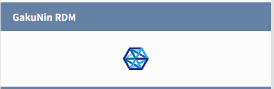
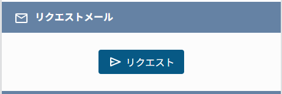

### 未病フロント アクセスコントロール

未病データベースにおけるアクセスコントロールについて記載する。

### 用語説明

本書では以下の用語で統一する。

| 用語       | 説明                                                  |
| ---------- | ----------------------------------------------------- |
| フロント   | 未病データベースのフロントエンド                      |
| WEKO       | 未病データベース用の WEKO3 リポジトリ（バックエンド） |
| 認証ユーザ | 目標 2 グループ所属のユーザ                           |

### 未病認証ユーザ

#### アクセス権限

| グループ       | ロール               | アクション                         |
| -------------- | -------------------- | ---------------------------------- |
| 認証ユーザ     | コントリビュータ以上 | 閲覧・編集・作成                   |
| 認証ユーザ以外 | リポジトリ管理者以上 | 閲覧・編集・作成                   |
| 上記以外       | 全ロール             | オープンアクセスのアイテム閲覧のみ |

#### 認証・認可フロー

1. ユーザはフロントのログイン画面から Shibboleth ログインを実施。
2. Shibboleth 認証後、ユーザの所属グループ情報を取得。
3. 所属グループに「目標 2」が含まれていれば、認証ユーザとして判定。
4. 認証ユーザに対して、アイテムの閲覧・編集・作成機能を提供する。

#### ログインをせずに非公開のアイテム詳細画面にアクセスした場合

1. エラーメッセージが表示され、エラーメッセージ記載の秒数後もしくはリンク押下でログイン画面に遷移。
2. Shibboleth ログインを実施。
3. ログイン完了後、アイテム詳細画面へリダイレクトする。
4. 認証ユーザであればアイテムの詳細が表示される。

   ※認証ユーザでない場合、再度エラーメッセージが表示される。その際はログイン画面への遷移は行われない。

### プロジェクト URL へのアクセス

#### GRDM ボタン

- > 該当のアイテムにプロジェクト URL が設定されている場合、アイテム詳細画面に GRDM ボタンが表示される。

  

  ボタンを押下すると別ウインドウでプロジェクト URL を閲覧することが出来る。

#### リクエストメール

- > アイテムにプロジェクト URL が設定されておらず、リクエストメールアドレスの設定がある場合はリクエストボタンが表示される。

  

  ボタンを押下するとリクエストメールフォームが開き、メールを送信することが出来る。

ユーザのログイン状況やロールは GRDM ボタン、およびリクエストボタンの表示条件に該当しない。

- > 更新履歴

<table>
<thead>
<tr class="header">
<th>日付</th>
<th>GitHubコミットID</th>
<th>更新内容</th>
</tr>
</thead>
<tbody>
<tr class="odd">
<td><blockquote>

2025/07/xx

</blockquote></td>
<td></td>
<td>初版作成</td>
</tr>
</tr>
</tbody>
</table>
